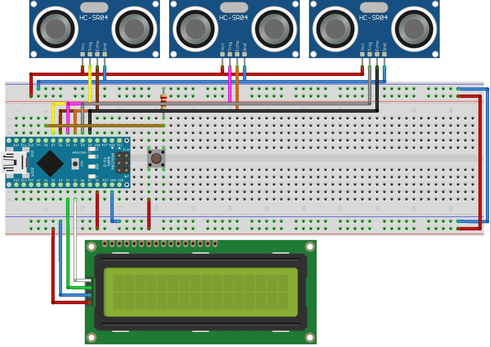

# Ultrasonic Distance Interaction

The Ultrasonic Distance Interaction is a mini game that was developed for my Master Thesis "Developing a Support Infrastructure for an Escape The Room and Peddy Paper Games".

This mini game, or interaction as I so call it, was developed to be part of an Escape the Room game that was also developed as part of my thesis. Since this interaction can work as a standalone mini game I decided to place it here for anyone interested in using it.

## List of Components
- Ultrasonic Sensor HC-SR04 (3x);
- Display LCD 16x2 1602 IIC (1x);
- Buttton (2x);
- 220Ω Resistor (1x);
- Arduino Nano (1x);

In order to fully assemble the Interaction, so as to look like the picture below, you will also need to 3D Print the enclosure parts that can be found [here](enclosure/).

## The Purpose of The Game

The Ultrasonic Distance Interaction uses distances as keys to solving the interaction. Through the usage of Ultrasonic Sensors, a person must position three objects at certain distances in order to solve this interaction. With this there is also the opportunity to explain how distance measurement through sound is possible, creating the opportunity to teach something alongside this mini game.

## Instructions

First start by uploading the code to your Arduino Nano (This is the one I used so I can only guarantee proper working with this micro-controller).

### Starting the Game

To start the game you must first type in the Arduino IDE serial monitor the following:

- > COM:START;ID:123456789

This command will then print in the Serial Monitor the solution of the game which then needs to be introduced using the keypad. If the introduced code is correct then the following message will appear in the serial monitor:

- > COM:INTERACTION_SOLVED;MSG:User Positioned Objects Correctly;PNT:750

## Warning

The source code for this interaction contains a lot of logic that was made to communicate with the infrastructure that was developed for my thesis and therefor it is not as clean as it could be when compared to a mini game that is developed with the intent of being used by the Arduino IDE directly.